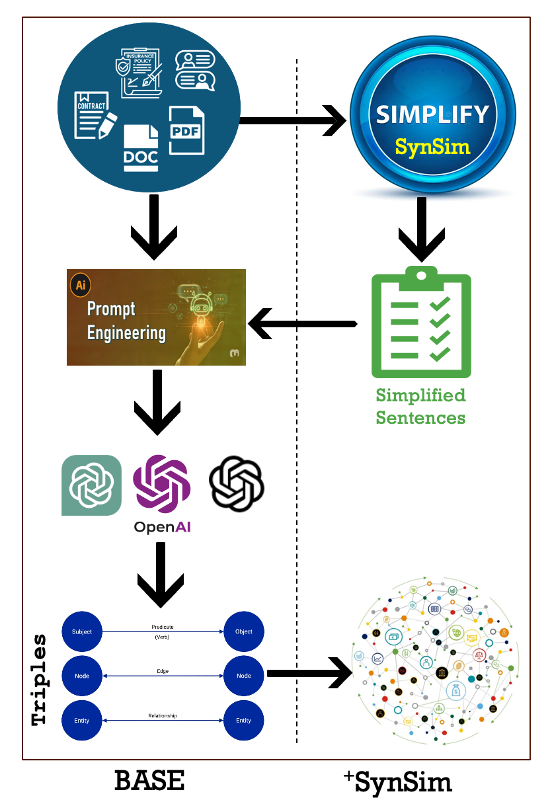

# SALMON — Syntactically Analysed and Language Model Optimised Natural Language

With the evolution of generative AI, we leverage Large Language Models (LLMs) to identify the triples from natural language text.  

Methodology:
-
<h3 align="center">
  Methodology of SALMON approach
  
</h3>

- From prompt engineering to fine-tuning, we have performed various experiments to find the best-fit prompt and parameters for the triple extraction task.  

- We have also integrated the [`SynSim`](https://github.com/salmon-kg/SynSim) approach to investigate its effectiveness in LLMs as well.  
- We have used our annotated dataset ([`TinyButMighty`](https://github.com/salmon-kg/TinyButMighty)) to evaluate the performance of the applied LLMs.  

Code Files:
- 
- gpt-triple-extractor.py: To extract the triple from text using GPT models i.e., gpt-3.5-turbo, gpt-4, text-davinci-003
- evalgpt: to evaluate the GPT output with the ground-truth triples. Amnesty/Penalty schemes are on choice.

- Data: Directory contains the data for assesment.

Citation:
-
Citation will be updated soon

---
