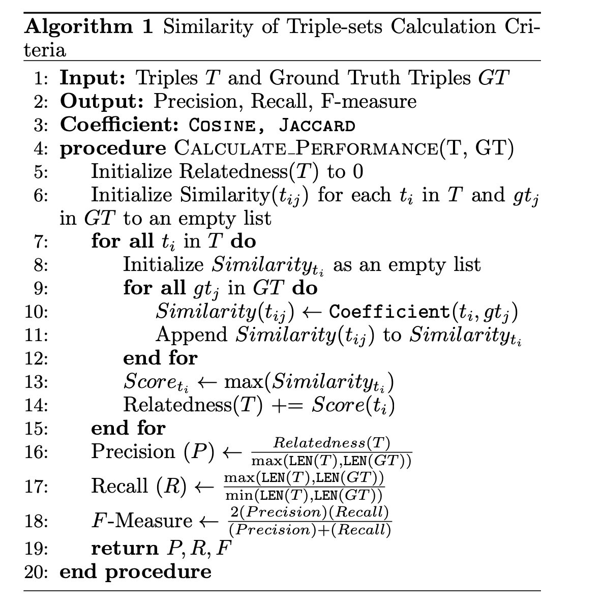
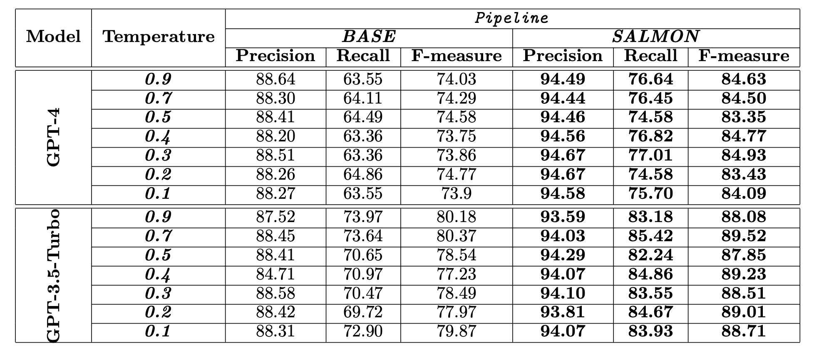
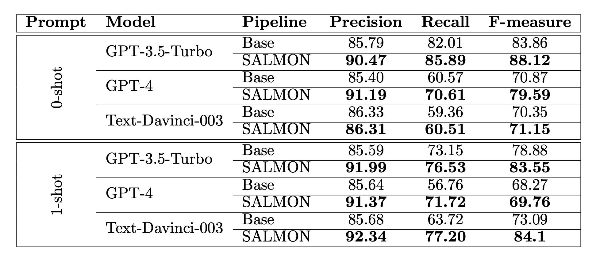

# SALMON — Syntactically Analysed and Language Model Optimised Natural Language

With the evolution of generative AI, we leverage Large Language Models (LLMs) to identify the triples from natural language text.  

## Methodology:

<h5 align="center">
  Methodology of SALMON approach
  
</h5>

- From prompt engineering to fine-tuning, we have performed various experiments to find the best-fit prompt and parameters for the triple extraction task. 

- We have also integrated the [`SynSim`](https://github.com/salmon-kg/SynSim) approach to investigate its effectiveness in LLMs as well.  
- We have used our annotated dataset ([`TinyButMighty`](https://github.com/salmon-kg/TinyButMighty)) to evaluate the performance of the applied LLMs.  

## Evaluation 
  
- Evaluation Criteria:  
	1. Triple Mentions' Vector.  
	2. Vector Similarity (Ground Truth VS Extracted Triple).  
  
- Similarity Measures:  
	1. Cosine Similarity.  
	2. Jaccard Similarity.  
	3. Fuzzy Similarity.  
  
- Evaluation Framework:  
  1. Calculating Each triple’s similarity score with GT Triples and keeping the highest similarity.
  2. Applying Amnesty or Penalty - based threshold schemes for optimised evaluation

## Algorithm

<h2 align="center">
  Applied Threshold on Triple Similarity Measure
  
</h2>

## Performance

<h2 align="center">
  The Performance of GPTs With Different Temperatures and with SALMON approach
  
</h2>

<h2 align="center">
  Overall Performance of Applied GPTs with and without SALMON integration
  
</h2>

## Test Files and Data:

- gpt-triple-extractor.py: To extract the triple from text using GPT models i.e., gpt-3.5-turbo, gpt-4, text-davinci-003
- evalgpt: to evaluate the GPT output with the ground-truth triples. Amnesty/Penalty schemes are on choice.

- Data: Directory contains the data for assesment.

## Citation:

Citation will be updated soon

---
